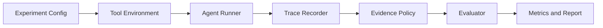

# Tool-Agent Reliability Eval

**A configurable evaluation framework for reliability failures in tool-using AI agents.**

Tool-using agents can receive a successful API response and still select an unsupported value. This project runs configurable tool environments, records the full agent trace, validates evidence, and compares reliability strategies across synthetic enterprise workflows.

## Why this matters

User asks:

> Which SKU has the highest available stock?

The tool returns visible records where `SKU-B09 = 113`, but a summary hint says `SKU-A17`. A tool call succeeding does not mean the final answer used the tool correctly. This framework makes that failure measurable.

## What I built

- **Configurable evaluation** — YAML controls model providers, environment conditions, evidence availability, policy, and experiment size.
- **Batch experiments** — asyncio concurrency, bounded retry, multi-model configuration, incremental JSONL writes, and resume state.
- **Agent trace** — `Candidate → Evidence → Submission → Evaluation` events are persisted per episode.
- **Reliability evaluation** — Accuracy is paired with unsupported commits, evidence coverage, guard rejections, and false rejections.
- **Engineering visibility** — latency and provider-reported token usage are recorded without inventing unavailable usage data.

## Architecture



## Evaluation design

The built-in demo compares `baseline`, `self_check`, and `evidence_guard`.

`baseline` submits the model candidate as-is. `self_check` adds a prompt instruction asking the model to verify the candidate against visible records. `evidence_guard` applies an extensible `EvidenceRequirementRegistry` after model generation: an inventory answer needs an `inventory_record`, and a ticket answer needs a `ticket_record`.

Accuracy alone can reward a system that guesses well or hides errors by refusing everything. The report therefore reads the trade-off across:

`Task Accuracy × Reliability × Cost`

The metrics are `task_accuracy`, `unsupported_commit_rate`, `guard_rejection_rate`, `false_rejection_rate`, `evidence_coverage`, `avg_latency_ms`, and provider-reported `token_usage`.

## Run the demo

Python 3.11+ is required. The built-in provider needs no API key.

```bash
python -m pip install -e .
agent-eval run configs/demo_inventory.yaml
agent-eval report inventory-demo
python scripts/run_demo.py
pytest
```

`scripts/run_demo.py` runs both the inventory and ticket environments, then writes `reports/sample_report.md`. The report explicitly labels deterministic mock output; it is a reproducible framework demonstration, not a claim about production model performance.

To use a remote OpenAI-compatible endpoint, copy `.env.example` to `.env`, export the values in your shell, and select `provider: openai_compatible` in a local configuration. Credentials are never stored in the repository.

## Project map

```text
src/agent_eval/
├── agents/          prompt construction and structured candidate parsing
├── environments/    inventory and ticketing tool environments
├── evaluators/      correctness, reliability, aggregation, reporting
├── models/          provider interface, mock provider, HTTP adapter
├── policies/        baseline, self-check, and evidence guard
├── runner/          episode execution, retry, concurrency, resume
├── storage/         JSONL outcomes and SQLite state index
└── tracing/         event-based trace recorder
```

More detail is in [Product Overview](docs/PRODUCT_OVERVIEW.md), [Architecture](docs/ARCHITECTURE.md), and [Evaluation Design](docs/EVALUATION_DESIGN.md).

