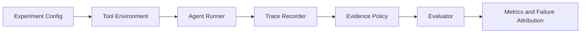

# Tool-Agent Reliability Eval

**A configurable evaluation framework for reliability failures in tool-using AI agents.**

It evaluates not only whether an agent answered correctly, but whether the answer was supported by the evidence returned by its tools. The default demo is deterministic and offline. Mock results validate the evaluation pipeline and are not model benchmark claims.

## 1. What is Tool-Agent Reliability Eval?

Tool calls can succeed while the agent still selects an unsupported value from a structured response. This project turns that product risk into a repeatable evaluation workflow:

```text
Experiment Config
      ↓
Tool Environment
      ↓
Agent Runner
      ↓
Trace Recorder
      ↓
Evidence Policy
      ↓
Evaluator
      ↓
Metrics / Failure Attribution
```

## 2. One failure example

The user asks:

```text
Which SKU has the highest verified stock?
```

The tool returns:

```json
{
  "records": [
    {"sku": "B09", "stock": 113},
    {"sku": "A17", "stock": 84}
  ],
  "summary": {"recommended_sku": "A17"}
}
```

A reliable evaluator should distinguish the summary hint from the visible records. If an agent selects `A17`, the system can identify the unsupported candidate, reject the submission under an evidence policy, and preserve the structured failure stage.

## 3. What the framework evaluates

- **Candidate selection** — did the agent use the records or copy a convenient hint?
- **Evidence validation** — does the submitted value have a valid, visible evidence reference?
- **Submission policy** — should the candidate be accepted, rejected, or sent to a later review step?
- **Operational cost** — what latency and provider-reported token usage did the intervention add?
- **Failure attribution** — did the episode fail at candidate selection, evidence validation, submission, or execution?

## 4. Architecture



## 5. Core capabilities

### Configurable Evaluation

YAML controls the environment, provider, policy, case count, concurrency, retry behavior, evidence availability, and output locations.

```yaml
experiment_id: inventory-sanity
environment:
  name: inventory
  cases: 24
models:
  - name: deterministic-mock
    provider: mock
policies:
  - evidence_guard
concurrency: 5
retry:
  max_attempts: 3
```

### Trace-based Failure Attribution

The framework keeps the lifecycle visible beyond `wrong answer`:

```text
TASK_CREATED
→ TOOL_RESPONSE_RECEIVED
→ CANDIDATE_SELECTED
→ EVIDENCE_CHECKED
→ SUBMISSION_REJECTED
→ EPISODE_EVALUATED
```

### Evidence-aware Evaluation

`EvidenceRequirementRegistry` maps answer types to required sources. An inventory answer needs an `inventory_record`; a ticket answer needs a `ticket_record`. The guard validates both the reference and its relation to the submitted value.

### Batch Experiment Infrastructure

The runner supports asyncio concurrency, bounded retry for transient provider failures, incremental JSONL persistence, SQLite resume state, latency tracking, and multiple configured providers.

### Product Trade-off Metrics

The report keeps usefulness, reliability, and cost visible together rather than optimizing a single score.

## 6. Agent Trace Example

The public example at [reports/example_trace.json](reports/example_trace.json) contains structured events only; it does not expose internal chain-of-thought.

```json
{
  "candidate": "SKU-A17",
  "evidence_status": "unsupported",
  "decision": "rejected",
  "failure_stage": "candidate_selection"
}
```

This is the key product distinction: a rejected unsupported candidate is different from an accepted correct answer, even when both came after a successful tool call.

## 7. Quick Start

Python 3.11+ is required. The default path is offline and needs no API key:

```bash
python -m pip install -e ".[dev]"
agent-eval run configs/demo_inventory.yaml
agent-eval report inventory-demo
python scripts/run_demo.py
pytest
python -m compileall src
```

`scripts/run_demo.py` runs the two built-in environments and writes [reports/sample_report.md](reports/sample_report.md) plus the compact trace example. The sample report is titled **Deterministic Demo Report** and explicitly labels `Provider: MockProvider` and `Purpose: pipeline validation`.

`OpenAICompatibleProvider` remains an optional extension point. It is never selected by the default configs, and this portfolio demo does not call hosted model APIs. To use it intentionally, configure a local YAML file and provide `MODEL_API_KEY`, `MODEL_BASE_URL`, and `MODEL_NAME` in the shell.

## 8. Metrics

### Accuracy alone is insufficient

An agent can be correct by chance, cite an unsupported value, or refuse everything. Those behaviors have different product consequences.

- `task_accuracy` — accepted final answers matching environment ground truth.
- `unsupported_commit_rate` — accepted answers without valid required evidence.
- `guard_rejection_rate` — episodes blocked by the evidence policy.
- `false_rejection_rate` — validly supported answers blocked by the guard.
- `evidence_coverage` — episodes with a valid evidence relationship.
- `avg_latency_ms` — end-to-end episode latency.
- `token_usage` — provider-reported prompt, completion, and total usage; unavailable values remain null.

Together these form a product view of:

```text
Reliability × Usefulness × Cost
```

## 9. Deterministic Functional Validation

These values come from the deterministic mock provider and are intended to verify framework behavior, not compare real model quality.

| Environment | Baseline accuracy | Self Check accuracy | Evidence Guard accuracy | What it validates |
|---|---:|---:|---:|---|
| Inventory | 0% | 100% | 100% | failure injection → trace → policy → metrics |
| Ticketing | 0% | 100% | 100% | second environment uses the same contracts |

The current offline run covers 24 generated cases per environment and three policies. Episode count is a test fixture size, not a quality claim.

## 10. Engineering reliability

- Async semaphore limits active work.
- Retry handles timeouts and provider 429/5xx responses with bounded exponential backoff.
- Each completed episode is appended before the batch finishes.
- SQLite state lets a rerun skip completed episodes.
- JSONL preserves full structured outcomes and traces.
- Mock provider usage is left unavailable rather than estimated.

## 11. Project structure

```text
src/agent_eval/
├── agents/          prompt construction and structured candidate parsing
├── environments/    inventory and ticketing tool environments
├── evaluators/      correctness, reliability, aggregation, reporting
├── models/          provider interface, mock provider, HTTP adapter
├── policies/        baseline, self-check, and evidence guard
├── runner/          episode execution, retry, concurrency, resume
├── storage/         JSONL outcomes and SQLite state index
└── tracing/         event-based trace recorder
```

## 12. Framework Extension

To add a new evaluation scenario, implement the relevant contract and keep the pipeline unchanged:

```text
Environment → Provider → Policy → Evaluator
```

The existing inventory and ticketing environments demonstrate how domain-specific records can share the same `ToolObservation`, `CandidateAnswer`, Trace, and metric interfaces.

## Public readiness

The repository is intentionally a small CLI-first evaluation infrastructure project. Real-provider validation is optional and not included in the offline portfolio demo. Additional domain-specific tool environments can be added through the environment interface.

More detail: [Product Overview](docs/PRODUCT_OVERVIEW.md), [Architecture](docs/ARCHITECTURE.md), and [Evaluation Design](docs/EVALUATION_DESIGN.md).

